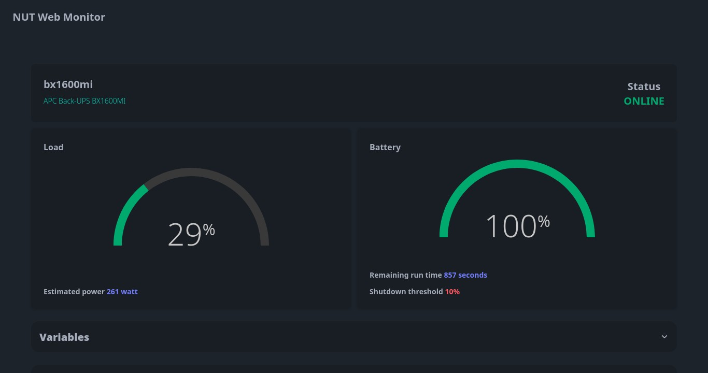
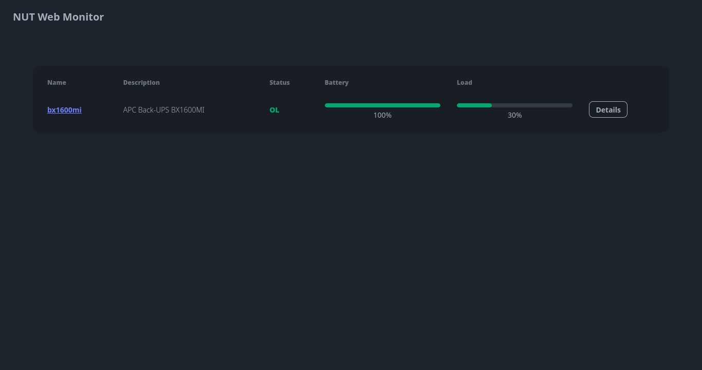

# NUT Web GUI


Web-based simple interface for [Network UPS Tools](https://networkupstools.org/).

**Quickstart:**

```shell
docker run --rm -e UPSD_ADDR=10.0.0.1 -e UPSD_USER=test -e UPSD_PASS=strongpass -p 9000:9000 ghcr.io/superioone/nut_webgui:latest   
```

## Features

- Monitoring UPS variables with auto refresh.
- List supported commands by UPS and allows INSTCMD calls from GUI.
- Lightweight and small.

> In order to run `INSTCMD`, make sure the configured user has proper instcmds granted at `upsd.users`. See
> man([upsd.users](https://networkupstools.org/docs/man/upsd.users.html)).





## Command-Line Arguments

The following command-line arguments can be used to configure the application:

* `--poll-freq`: Specify the poll frequency in seconds. Default is `10`.
* `--upsd-addr`: Specify the UPS daemon address. Default is `localhost`.
* `--upsd-port`: Specify the UPS daemon port. Default is `3493`.
* `--upsd-user`: Specify the UPS daemon username.
* `--upsd-pass`: Specify the UPS daemon password.
* `--listen`: Specify the listen address for the HTTP server. Default is `0.0.0.0`.
* `--port`: Specify the port used by the HTTP server. Default is `9000`.
* `--log-level`: Specify the log level for the HTTP server. Default is `info`.
* `--static-dir`: Specify the location of static css and js files served by the HTTP server. Default is `./static`.

## Container Image Environment Variables

The following environment variables can be used to configure the application:

* `POLL_FREQ`: Specify the poll frequency in seconds. Default is `10`.
* `UPSD_ADDR`: Specify the UPS daemon address. Default is `localhost`.
* `UPSD_PORT`: Specify the UPS daemon port. Default is `3493`.
* `UPSD_USER`: Specify the UPS daemon username.
* `UPSD_PASS`: Specify the UPS daemon password.
* `LISTEN`: Specify the listen address for the HTTP server. Default is `0.0.0.0`.
* `PORT`: Specify the port used by the HTTP server. Default is `9000`.
* `LOG_LEVEL`: Specify the log level for the HTTP server. Default is `info`.

## Examples

- [Kubernetes with EndpointSlice](docs/kubernetes_example.md)
- [Docker compose](docs/docker_compose.md)
