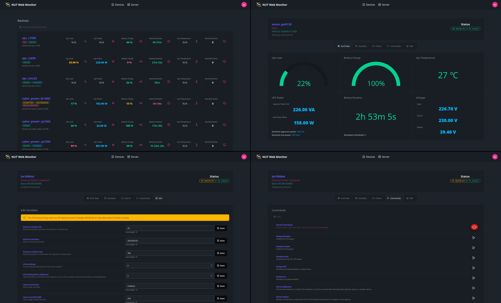

# NUT Web GUI

Light weight web interface for [Network UPS Tools](https://networkupstools.org/).



## Quickstart

```shell
docker run -p 9000:9000 \
  -e UPSD_ADDR=10.0.0.1 \
  -e UPSD_USER=test \
  -e UPSD_PASS=strongpass \
  ghcr.io/superioone/nut_webgui:latest
```

## Features

- Monitors UPS variables with auto refresh.
- Supports INSTCMD, SET VAR, and FSD calls from GUI.
- 🥔 Potato PC friendly. Small footprint on both resource usage and disk size.
- Basic JSON API.
- Supports RISC-V and older ARM devices.

> In order to run `INSTCMD` and `FSD`, make sure the configured user has proper privileges given at `upsd.users`. See
> man([upsd.users](https://networkupstools.org/docs/man/upsd.users.html)).

## Examples

- [Volumes and args](docs/examples/01_volumes_and_args.md)
- [Docker/Podman compose](docs/examples/02_compose.md)
- [Kubernetes - Basic](docs/examples/03_kubernetes_basic.md)
- [Kubernetes - EndpointSlice](docs/examples/04_kubernetes_endpointslice.md)
- [Custom base path for reverse proxy](docs/examples/05_reverse_proxy_base_path.md)
- [Accessing localhost](docs/examples/06_accessing_localhost.md)
- [Using NUT with TLS](docs/examples/07_nut_and_tls.md)
- [Enabling Auth and API Keys](docs/examples/08_enabling_auth.md)

## CPU architecture support

| Arch         | Test Hardware           | Notes                                                                                         |
|--------------|-------------------------|-----------------------------------------------------------------------------------------------|
| amd64        | AM4 CPU                 | Works across all amd64 platforms.                                                             |
| amd64-v3     | AM4 CPU                 | Snake oil level optimizations with AVX. It mostly improves response compression, and TLS.     |
| amd64-v4     | Intel® SDE              | Snake oil level optimizations with AVX-512. It mostly improves response compression, and TLS. |
| arm64        | Raspberry Pi 4 Model B  |                                                                                               |
| armv7        | Qemu emulation          | Uses software floating-point.                                                                 |
| armv6        | Qemu emulation          | Uses software floating-point.                                                                 |
| riscv64      | Qemu emulation          |                                                                                               |

> amd64 v3 and v4 variants require certain CPU feature flags to run. If you are a crackhead min-max enjoyer (like me), you can use 
> `nut_webgui:latest-amd64-v3` and `nut_webgui:latest-amd64-v4` images.
>
> See [x86-64 Microarchitecture levels](https://en.wikipedia.org/wiki/X86-64#Microarchitecture_levels) for more details.

## Configuration

nut_webgui can be configured via args, environment variables, or config file. All configuration options are merged into single unified config based on their priority.

### CLI arguments

CLI arguments hold the highest priority in configuration settings. You can override existing configurations by using them.

* `--allow-env`: Allows application to load configuration from environment variables.
* `--base-path`: Overrides HTTP server base path. Default is `/`.
* `--config-file`: config.toml path.
* `--default-theme`: Web UI default theme.
* `--listen`: Listen address for the HTTP server. Default is `0.0.0.0`.
* `--log-level`: Log level for the HTTP server. Default is `info`.
* `--poll-freq`: UPS [pollfreq](https://networkupstools.org/docs/man/ups.conf.html#_global_directives) in seconds. Default is `30`.
* `--poll-interval`: UPS [pollinterval](https://networkupstools.org/docs/man/ups.conf.html#_global_directives) in seconds. Default is `2`.
* `--port`: Port used by the HTTP server. Default is `9000`.
* `--server-key`: Private server key value. Default is randomly auto generated value.
* `--upsd-addr`: UPS daemon address. Default is `localhost`.
* `--upsd-max-connection`: Allowed maximum connection for UPSD client. Default is `4`.
* `--upsd-pass`: UPS daemon password.
* `--upsd-port`: UPS daemon port. Default is `3493`.
* `--upsd-tls-mode`: Configures TLS communication between UPSD and client. Default is `disable`.
* `--upsd-user`: UPS daemon username.
* `--with-auth`: Enables authentication with `user.toml` file.

### Container image environment variables

Environment variables have the second-highest priority in configuration settings. They can also accept paths as values. When an environment variable 
specifies a file path, the system automatically reads content of that file as a value.

| Names                            | Aliases          | Default                       | Values                                      | Description                                                        |
|----------------------------------|------------------|-------------------------------|---------------------------------------------|--------------------------------------------------------------------|
| `NUTWG__CONFIG_FILE`             |`CONFIG_FILE`     | `/etc/nut_webgui/config.toml` | File path                                   | Custom config.toml file path.                                      |
| `NUTWG__DEFAULT_THEME`           |`DEFAULT_THEME`   | None                          | See [config.toml](./containers/config.toml) | Web UI default theme.                                              |
| `NUTWG__LOG_LEVEL`               |`LOG_LEVEL`       | `info`                        | `error`, `warn`, `info`, `debug`, `trace`   | Log level.                                                         |
| `NUTWG__SERVER_KEY`              |`SERVER_KEY`      | `/etc/nut_webgui/server.key`  | File path, UTF-8 string                     | Server sign key used for signing session tokens.                   |
| `NUTWG__AUTH__USERS_FILE`        |`AUTH_USERS_FILE` | None                          | File path                                   | Enables authentication with the provided `users.toml` file.        |
| `NUTWG__HTTP_SERVER__BASE_PATH`  |`BASE_PATH`       | `/`                           |                                             | Overrides HTTP server base path.                                   |
| `NUTWG__HTTP_SERVER__LISTEN`     |`LISTEN`          | `0.0.0.0`                     |                                             | Works across all amd64 platforms.                                  |
| `NUTWG__HTTP_SERVER__PORT`       |`PORT`            | `9000`                        | 1-65535                                     | Works across all amd64 platforms.                                  |
| `NUTWG__UPSD__ADDRESS`           |`UPSD_ADDR`       | `localhost`                   | IPv6, IPv4, hostname                        | UPS daemon address.                                                |
| `NUTWG__UPSD__MAX_CONNECTION`    |                  | `4`                           |                                             | Allowed maximum connection for UPSD client.                        |
| `NUTWG__UPSD__PASSWORD`          |`UPSD_PASS`       | None                          |                                             | UPS daemon password.                                               |
| `NUTWG__UPSD__POLL_FREQ`         |`POLL_FREQ`       | `30`                          |                                             | Non-critical ups variables update frequency in seconds.            |
| `NUTWG__UPSD__POLL_INTERVAL`     |`POLL_INTERVAL`   | `2`                           |                                             | Critical ups variables (`ups.status`) update interval in seconds.  |
| `NUTWG__UPSD__PORT`              |`UPSD_PORT`       | `3493`                        | 1-65535                                     | UPS daemon port.                                                   |
| `NUTWG__UPSD__TLS_MODE`          |`UPSD_TLS`        | `disable`                     | `strict`, `disable`, `skip`                 | Configures TLS communication between UPSD and client.              |
| `NUTWG__UPSD__USERNAME`          |`UPSD_USER`       | None                          |                                             | UPS daemon username.                                               |
| `UPSD_ROOT_CA`                   |                  | None                          |                                             | Path to the Root CA certificate for TLS.                           |

### TOML config

Config.toml has the least priority, but it's recommended to use the config file as a baseline configuration and use environment variables or command-line arguments 
to override settings.

```toml
log_level = "info"
default_theme = "tokyo-night"

[http_server]
base_path = "/"
listen = "0.0.0.0"
port = 9000

[upsd]
username = "admin"
password = "test"
address = "localhost"
port = 3493
max_connection = 4
poll_freq = 30
poll_interval = 2
tls_mode = "disabled"

[auth]
users_file = "/etc/nut_webgui/users.toml"
```

For more detailed config template see [./containers/config.toml](./containers/config.toml).

## JSON data API

A simple JSON-based API is available for integration and automation purposes.

OpenAPI 3.0.0 specification files: [json](docs/api_specs/openapi3_spec.json) | [yaml](docs/api_specs/openapi3_spec.yaml)

## Probes

nut_webgui has basic probe endpoints to check server health and readiness:
- `/probes/health`
- `/probes/readiness`

## Building from source and debugging

[Building and Debugging](./docs/building_debugging.md)

[Custom Build Pipeline](./docs/custom_build_pipeline.md)
