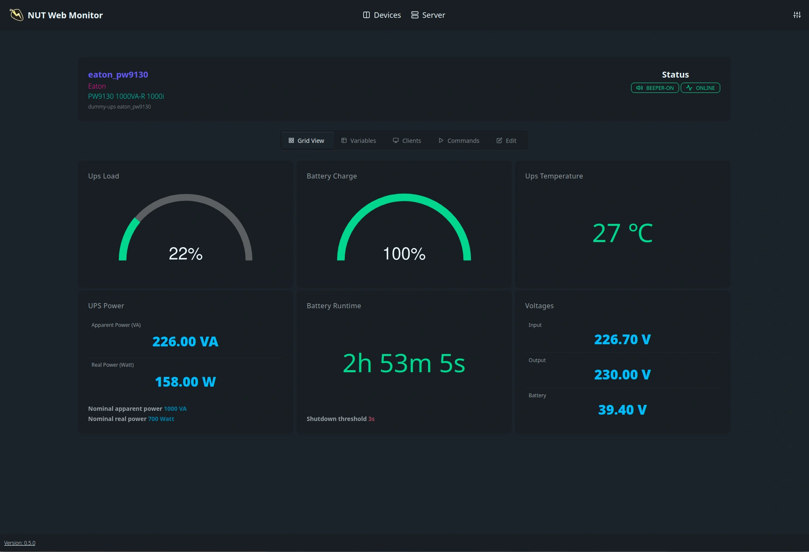
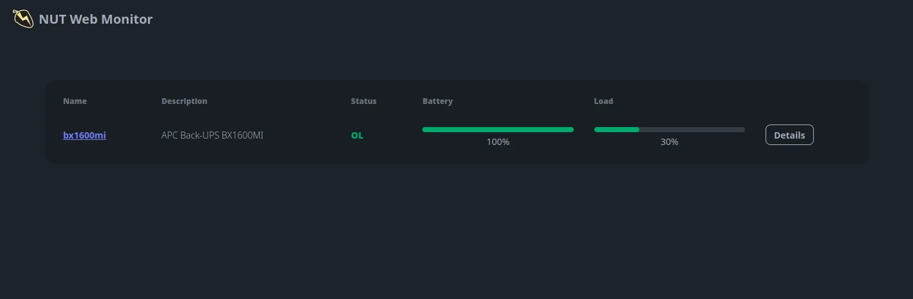
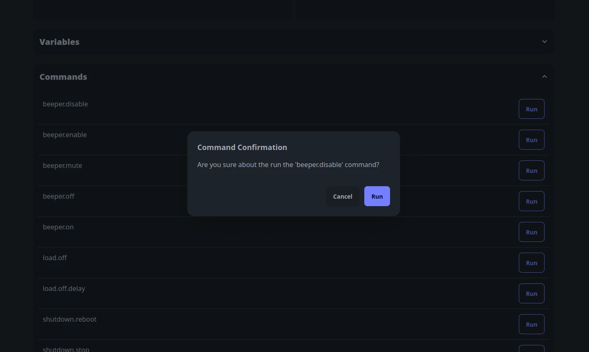

# NUT Web GUI

Light weight web interface for [Network UPS Tools](https://networkupstools.org/).

**Quickstart:**

```shell
docker run -e UPSD_ADDR=10.0.0.1 -e UPSD_USER=test -e UPSD_PASS=strongpass -p 9000:9000 ghcr.io/superioone/nut_webgui:latest
```

## Features

- Monitors UPS variables with auto refresh.
- Supports INSTCMD calls from GUI.
- 🥔 Potato PC friendly. Small footprint on both resource usage and disk size.
- Basic JSON API.
- Supports RISC-V and older ARM devices.

> In order to run `INSTCMD`, make sure the configured user has proper instcmds granted at `upsd.users`. See
> man([upsd.users](https://networkupstools.org/docs/man/upsd.users.html)).

## CPU architecture support

| Arch         | Test Hardware           | Notes                                                                                    |
|--------------|-------------------------|------------------------------------------------------------------------------------------|
| amd64        | AM4                     | Works across all amd64 platforms.                                                        |
| amd64-v3     | AM4                     | Snake oil level optimizations with AVX. It mostly reduces response compression overhead. |
| amd64-v4     | Not Tested              | Snake oil level optimizations with AVX-512.                                              |
| arm64        | Raspberry Pi 4 Model B  |                                                                                          |
| armv7        | Qemu emulation          |                                                                                          |
| armv6        | Qemu emulation          |                                                                                          |
| riscv64      | Qemu emulation          |                                                                                          |

> amd64 v3 and v4 variants require certain CPU feature flags to run. If you are a crackhead min-max enjoyer (like me), you can use `nut_webgui:latest-amd64-v3` and `nut_webgui:latest-amd64-v4` images.
> See [x86-64 Microarchitecture levels](https://en.wikipedia.org/wiki/X86-64#Microarchitecture_levels) for more details.







## Command-Line arguments

* `--poll-freq`: UPS[pollfreq](https://networkupstools.org/docs/man/ups.conf.html#_global_directives) in seconds. Default is `30`.
* `--poll-interval`: UPS [pollinterval](https://networkupstools.org/docs/man/ups.conf.html#_global_directives) in seconds. Default is `2`.
* `--upsd-addr`: UPS daemon address. Default is `localhost`.
* `--upsd-port`: UPS daemon port. Default is `3493`.
* `--upsd-user`: UPS daemon username.
* `--upsd-pass`: UPS daemon password.
* `--listen`: Listen address for the HTTP server. Default is `0.0.0.0`.
* `--port`: Port used by the HTTP server. Default is `9000`.
* `--log-level`: Log level for the HTTP server. Default is `info`.
* `--static-dir`: Directory path for static files. Default is `./static`.

## Container image environment variables

* `POLL_FREQ`: UPS [pollfreq](https://networkupstools.org/docs/man/ups.conf.html#_global_directives) in seconds. Default is `30`.
* `POLL_INTERVAL`: UPS [pollinterval](https://networkupstools.org/docs/man/ups.conf.html#_global_directives) in seconds. Default is `2`.
* `UPSD_ADDR`: UPS daemon address. Default is `localhost`.
* `UPSD_PORT`: UPS daemon port. Default is `3493`.
* `UPSD_USER`: UPS daemon username.
* `UPSD_PASS`: UPS daemon password.
* `LISTEN`: Listen address for the HTTP server. Default is `0.0.0.0`.
* `PORT`: Port used by the HTTP server. Default is `9000`.
* `LOG_LEVEL`: Log level. Default is `info`.

## JSON data API

A simple JSON-based API is available for integration and automation purposes. For usage details
see [JSON data API page.](./docs/json_api.md)

## Probes

The server offers a basic health probe at the `/probes/health` endpoint. This can be used as liveness or readiness
checks in your systems.

## Examples

- [Kubernetes with EndpointSlice](docs/kubernetes_example.md)
- [Docker compose](docs/docker_compose.md)

## Building from source and debugging

See [Building and Debugging.](./docs/building_debugging.md)
