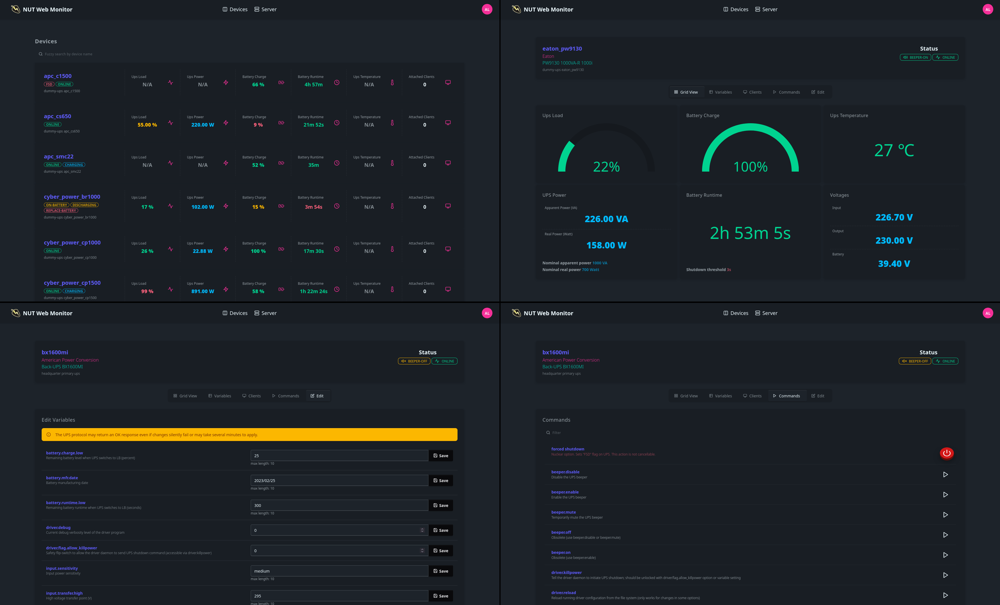

# NUT Web GUI

Lightweight web interface for [Network UPS Tools](https://networkupstools.org/).



## Quickstart

Docker/Podman:

```shell
docker run -p 9000:9000 \
  -e UPSD_ADDR=10.0.0.1 \
  -e UPSD_USER=test \
  -e UPSD_PASS=strongpass \
  ghcr.io/superioone/nut_webgui:latest
```

Container image registries:
 - **Codeberg:**
     codeberg.org/superiorone/nut_webgui:latest
 - **GitHub:**
    ghcr.io/superioone/nut_webgui:latest

## Features

- Monitors UPS variables with auto-refresh.
- Supports INSTCMD, SET VAR, and FSD calls from GUI.
- Potato PC friendly. Small footprint on both resource usage and disk size.
- Basic JSON API.
- Supports RISC-V and older ARM devices.

> In order to run `INSTCMD` and `FSD`, make sure the configured user has the 
> proper privileges in `upsd.users`. See
> man([upsd.users](https://networkupstools.org/docs/man/upsd.users.html)).

## Examples/How-To's

- [Volumes and args](docs/examples/01_volumes_and_args.md)
- [Docker/Podman compose](docs/examples/02_compose.md)
- [Kubernetes - Basic](docs/examples/03_kubernetes_basic.md)
- [Kubernetes - EndpointSlice](docs/examples/04_kubernetes_endpointslice.md)
- [Custom base path for reverse proxy](docs/examples/05_reverse_proxy_base_path.md)
- [Accessing localhost](docs/examples/06_accessing_localhost.md)
- [Using NUT with TLS](docs/examples/07_nut_and_tls.md)
- [Enabling Auth and API Keys](docs/examples/08_enabling_auth.md)
- [Connecting multiple NUT servers](docs/examples/09_multiple_nut_connection.md)
- [Binary installation](docs/examples/10_binary_installation.md)
- [Events API](docs/examples/11_events_api.md)
- [OpenMetrics](docs/examples/12_openmetrics.md)

## CPU architecture support

| Arch     | Test Hardware          | Notes                                                                                         |
|----------|------------------------|-----------------------------------------------------------------------------------------------|
| amd64    | AM4 CPU                | Works across all amd64 platforms.                                                             |
| amd64-v3 | AM4 CPU                | Snake-oil level optimizations with AVX. It mostly improves response compression, and TLS.     |
| amd64-v4 | Intel® SDE             | Snake-oil level optimizations with AVX-512. It mostly improves response compression, and TLS. |
| arm64    | Raspberry Pi 4 Model B |                                                                                               |
| armv7    | Qemu emulation         | Uses software floating-point.                                                                 |
| armv6    | Qemu emulation         | Uses software floating-point.                                                                 |
| riscv64  | Qemu emulation         |                                                                                               |

> amd64 v3 and v4 variants require certain CPU feature flags to run. If you are
> a crackhead min-max enjoyer (like me), you can use `nut_webgui:latest-amd64-v3`
> and `nut_webgui:latest-amd64-v4` images.
> See [x86-64 Microarchitecture levels](https://en.wikipedia.org/wiki/X86-64#Microarchitecture_levels)
> for more details.

## Configuration

nut_webgui can be configured via args, environment variables, or config file.
All configuration options are merged into single unified config based on their
priority.

### CLI arguments

CLI arguments hold the highest priority in configuration settings.

* `--allow-env`: Allows application to load configuration from environment
variables.
* `--base-path`: Overrides HTTP server base path. Default is `/`.
* `--config-file`: config.toml path.
* `--default-theme`: Web UI default theme.
* `--listen`: Listen address for the HTTP server. Default is `0.0.0.0`.
* `--log-level`: Log level for the HTTP server. Default is `info`.
* `--port`: Port used by the HTTP server. Default is `9000`.
* `--server-key`: Private server key value. Default is randomly auto-generated
value.
* `--with-auth`: Enables authentication with `user.toml` file.
* `--worker-count`: Sets HTTP server worker count.

### Environment variables

Environment variables have the second-highest priority in configuration
settings. Accepts direct values or file paths (automatically reads file
contents).

#### General

|Name                              |Alias (Container Only)|Default                      |Value Type                               |Description                                                |
|----------------------------------|----------------------|-----------------------------|-----------------------------------------|-----------------------------------------------------------|
|`NUTWG__CONFIG_FILE`              |`CONFIG_FILE`         |`/etc/nut_webgui/config.toml`|File path                                |Custom `config.toml` file path.                            |
|`NUTWG__DEFAULT_THEME`            |`DEFAULT_THEME`       |None                         |See [config.toml](./dist/config.toml)    |Web UI default theme.                                      |
|`NUTWG__LOG_LEVEL`                |`LOG_LEVEL`           |`info`                       |`error`, `warn`, `info`, `debug`, `trace`|Log level.                                                 |
|`NUTWG__SERVER_KEY`               |`SERVER_KEY`          |`/etc/nut_webgui/server.key` |File path, UTF-8 string                  |Server sign key used for signing session tokens.           |
|`NUTWG__AUTH__USERS_FILE`         |`AUTH_USERS_FILE`     |None                         |File path                                |Enables authentication with the provided `users.toml` file.|
|`NUTWG__HTTP_SERVER__BASE_PATH`   |`BASE_PATH`           |`/`                          |URI path                                 |Overrides HTTP server base path.                           |
|`NUTWG__HTTP_SERVER__LISTEN`      |`LISTEN`              |`0.0.0.0`                    |IPv4, IPv6                               |HTTP server listen address.                                |
|`NUTWG__HTTP_SERVER__PORT`        |`PORT`                |`9000`                       |1-65535                                  |HTTP server listen port.                                   |
|`NUTWG__HTTP_SERVER__WORKER_COUNT`|                      |All CPU cores                |1-usize::MAX                             |HTTP server worker count.                                  |


#### Default UPSD

If you only connect to a single NUT server and want to keep configurations
simple as possible, connection details can be configured via `NUTWG__UPSD__*`
environment variables.

|Name                         |Alias (Container Only)| Default  |Value Type                 |Description                                                      |
|-----------------------------|----------------------|----------|---------------------------|-----------------------------------------------------------------|
|`NUTWG__UPSD__ADDRESS`       |`UPSD_ADDR`           |          |IPv6, IPv4, hostname       |UPS daemon address.                                              |
|`NUTWG__UPSD__MAX_CONNECTION`|                      | `4`      |1-usize::Max               |Allowed maximum connection for UPSD client.                      |
|`NUTWG__UPSD__NAME`          |                      | `default`|Text                       |Target namespace for the `NUTWG__UPSD__*` environment variables. |
|`NUTWG__UPSD__PASSWORD`      |`UPSD_PASS`           | None     |Text                       |UPS daemon password.                                             |
|`NUTWG__UPSD__POLL_FREQ`     |`POLL_FREQ`           | `30`     |1-u64::Max                 |Non-critical ups variables update frequency in seconds.          |
|`NUTWG__UPSD__POLL_INTERVAL` |`POLL_INTERVAL`       | `2`      |1-u64::Max                 |Critical ups variables (`ups.status`) update interval in seconds.|
|`NUTWG__UPSD__PORT`          |`UPSD_PORT`           | `3493`   |1-65535                    |UPS daemon port.                                                 |
|`NUTWG__UPSD__TLS_MODE`      |`UPSD_TLS`            | `disable`|`strict`, `disable`, `skip`|Configures TLS communication between UPSD and client.            |
|`NUTWG__UPSD__USERNAME`      |`UPSD_USER`           | None     |Text                       |UPS daemon username.                                             |

#### Container only

The following environment variables are available only to container images and
do not apply to binary installations.

|Name          |Default       |Value Type| Description                                                                                              |
|--------------|--------------|----------|----------------------------------------------------------------------------------------------------------|
|`UPSD_ROOT_CA`|None          |Path      |Path to the Root CA certificate for TLS.                                                                  |
|`UID`         |1000          |1-65535   |User UID running the server. Ignored when container already starts with non-root user via `--user` option.|
|`GID`         |Value of `UID`|1-65535   |User GID running the server. Ignored when container already starts with non-root via `--user` option.     |

### TOML config

Config.toml has the least priority, but it's recommended to use the config file
as a baseline configuration and use environment variables and command-line
arguments to override settings when needed.

```toml
version = "1"
log_level = "info"
default_theme = "tokyo-night"

[http_server]
base_path = "/"
listen = "0.0.0.0"
port = 9000
worker_count = 8

[upsd.default]
username = "admin"
password = "where an old man of Aran goes around and around"
address = "localhost"
port = 3493
max_connection = 4
poll_freq = 30
poll_interval = 2
tls_mode = "disable"

[upsd.reactor]
address = "10.0.12.10"
username = "observer"
password = "AbsoluteSecurity"

[auth]
users_file = "/etc/nut_webgui/users.toml"
```

For more detailed config template see [./dist/config.toml](./dist/config.toml).

### UniFi NUT Specific Configuration

The current UniFi NUT server supports up to 3 client connections, and when this
limit is exceeded, the server restarts itself. To prevent this issue,
**set the maximum connection limit to 1** using one of the following methods:

- Set the `NUTWG__UPSD__MAX_CONNECTION` environment variable if you are using
a single NUT server
- Configure `max_connection` in the `config.toml` file

## JSON data API

A simple JSON-based API is available for general-purpose integrations.

OpenAPI 3.0.0 specification files: [json](docs/api_specs/openapi3_spec.json)
| [yaml](docs/api_specs/openapi3_spec.yaml)

## Events API

Real-time UPS events can read via WebSocket at `/events`. For more details see
[Events API](docs/examples/11_events_api.md).

## Probes

nut_webgui has basic probe endpoints to check server health and readiness:
- `/probes/health`
- `/probes/readiness`

If you've multiple NUT server connections, you can also probe the individual
connection:

- `/probes/health/<namespace>`
- `/probes/readiness/<namespace>`

## OpenMetrics

UPS metrics can be scraped from `/metrics` endpoint. For more details see the 
[OpenMetrics](docs/examples/12_openmetrics.md).

## Building from source and debugging

[Building and Debugging](./docs/building_debugging.md)

[Custom Build Pipeline](./docs/custom_build_pipeline.md)
