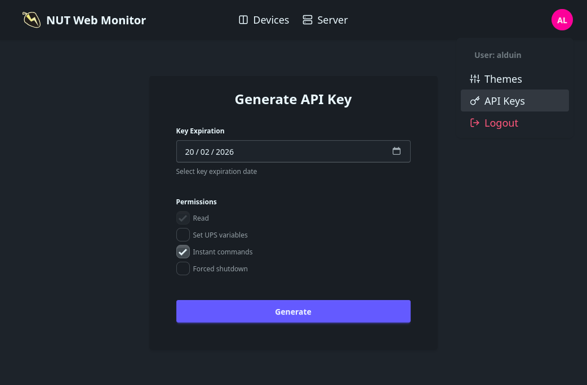
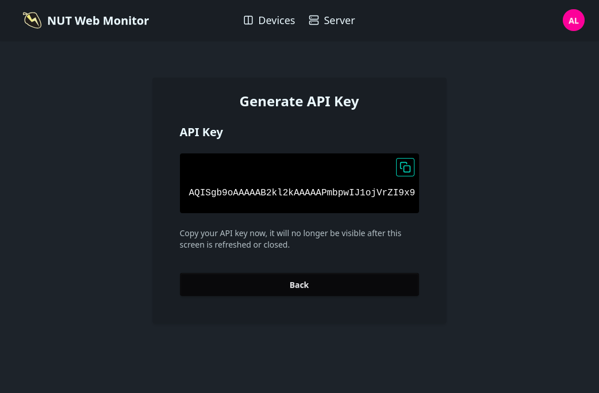

# Enabling Authentication

## Basic

Authentication can be enabled:
- Via CLI arg `--with-auth "/etc/nut_webgui/users.toml"`
- Via environment variable `AUTH_USERS_FILE "/etc/nut_webgui/users.toml"`
- Via `config.toml` file
  ```toml
  [auth]
  users_file: "/etc/nut_webgui/users.toml"
  ```

**users.toml**

```toml
[username]
password = "asdf"
permissions = ["setvar", "instcmd", "fsd"]  # (Optional) additional permissions

[username2]
password = "passw0rd"

[spear-of-democracy]
password = "down-up-right-up-left-right"
permissions = ["instcmd"]

[sector-g-admin]
password = "otis123"
permissions = ["fsd"]
```

**docker-compose.yaml**
```yaml
version: "3.3"
services:
  nutweb:
    image: ghcr.io/superioone/nut_webgui:latest
    restart: always
    ports:
      - 9000:9000
    environment:
      UPSD_USER: "/run/secrets/upsd_username"
      UPSD_PASS: "/run/secrets/upsd_password"
      AUTH_USERS_FILE: "/run/secrets/users_file"
    secrets:
      - upsd_username
      - upsd_password
      - users_file
    volumes:
      - config-data:/etc/nut_webgui

volumes:
  config-data:

secrets:
  upsd_username:
    file: ./upsd_user.txt
  upsd_password:
    file: ./upsd_password.txt
  users_file:
    file: ./users.toml
```

## Server Key: Multiple instances and container restarts

All user sessions are signed using the server key. Changing the server key will invalidate existing sessions and API keys.
If you have multiple instances behind a load-balancer or want to keep active sessions alive after container restarts,
ensure the server key is persisted appropriately.

On application startup, `nut_webgui` automatically generates a new server key at `/etc/nut_webgui/server.key` if one does
not already exist and no server key configuration is provided.

**docker-compose.yaml**
```yaml
version: "3.3"
services:
  nutweb:
    image: ghcr.io/superioone/nut_webgui:latest
    restart: always
    deploy:
      mode: replicated
      replicas: 3
    ports:
      - 9000:9000
    environment:
      UPSD_USER: "/run/secrets/upsd_username"
      UPSD_PASS: "/run/secrets/upsd_password"
      AUTH_USERS_FILE: "/run/secrets/users_file"
      SERVER_KEY: "format-is-not-important-any-text-will-work" # You can also provide the key via file/secret/config file
    secrets:
      - upsd_username
      - upsd_password
      - users_file
    volumes:
      - config-data:/etc/nut_webgui

volumes:
  config-data:

secrets:
  upsd_username:
    file: ./upsd_user.txt
  upsd_password:
    file: ./upsd_password.txt
  users_file:
    file: ./users.toml
```

## API Keys

When authentication is enabled, `/api` endpoints start using `Bearer` authorization scheme. You can create new API keys through `/api-keys` page.

> You can only issue API keys based on your existing permissions.

<div style="width: 100%; display: grid; gap: 3px; grid-template-columns: repeat(2, 1fr)">





</div>

**Example token usage:**

```bash
curl localhost:9000/api/ups -H "Authorization: bearer TOKEN"

# scheme part is case-insensitive
curl localhost:9000/api/ups -H "Authorization: BEARER TOKEN"
```
