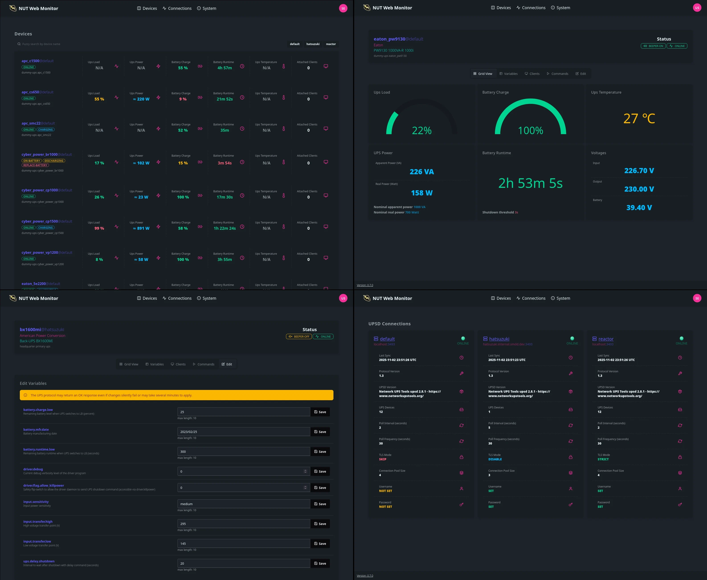

<details style="cursor:pointer">
<summary><b>Ain't Nobody Got Time for That</b></summary>

Change the parameters and start the container image:

```sh
docker run -p 9000:9000 \
  -e UPSD_ADDR=10.0.0.1 \
  -e UPSD_USER=test \
  -e UPSD_PASS=strongpass \
  codeberg.org/superiorone/nut_webgui:latest
```

</details>

# Introduction

**nut_webgui** is a modern alternative to **upsstats.cgi**[^upsstats]. It
displays UPS device stats from multiple NUT servers, provides APIs for basic
programming, and implements the RFC9271[^rfc] protocol for UPS management.

> [!IMPORTANT]
> In order to run `INSTCMD`, `SETVAR`, and `FSD`, make sure the configured user
has the proper privileges in `upsd.users`[^upsd_users].

<div align="center">
  
</div>



## Supported CPU architectures

|Arch    |Test Hardware         |Notes                                                                                        |
|--------|----------------------|---------------------------------------------------------------------------------------------|
|amd64   |AM4 CPU               |Works across all amd64 platforms.                                                            |
|amd64/v3|AM4 CPU               |Snake-oil level optimizations with AVX. It mostly improves response compression and TLS.     |
|amd64/v4|Intel® SDE            |Snake-oil level optimizations with AVX-512. It mostly improves response compression and TLS. |
|arm64/v8|Raspberry Pi 4 Model B|                                                                                             |
|arm/v7  |Qemu emulation        |Uses software floating-point.                                                                |
|arm/v6  |Qemu emulation        |Uses software floating-point.                                                                |
|riscv64 |Qemu emulation        |                                                                                             |

> [!NOTE]
> **v3** and **v4** variants require certain CPU feature flags to run. These
> builds are available as `nut_webgui:latest-amd64-v3` and `nut_webgui:latest-amd64-v4`
> image tags.

## Application requirements

- Linux (kernel >= 4.4), FreeBSD >= 15
- 32 MiB memory
- 10 MiB disk space for the server binary and config files.
- `libgcc_s` and `GLIBC` for `*-gnu` targets.

[^upsstats]: [networkupstools.org - upsstats.cgi](https://networkupstools.org/docs/man/upsstats.cgi.html)
[^upsd_users]: [networkupstools.org - upsd.users](https://networkupstools.org/docs/man/upsstats.cgi.html)
[^rfc]: [Uninterruptible Power Supply (UPS) Management Protocol - RFC9271](https://www.rfc-editor.org/rfc/rfc9271.html)
