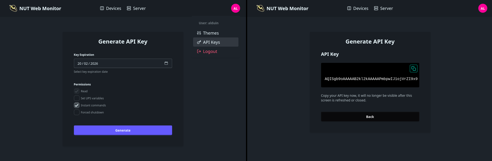

# Authentication

Basic authentication can be enabled in one of the following ways:
- Via the CLI argument: `--with-auth "/etc/nut_webgui/users.toml"`
- Via the environment variable: `AUTH_USERS_FILE="/etc/nut_webgui/users.toml"`
- Via the `config.toml` file:
  ```toml
  [auth]
  users_file = "/etc/nut_webgui/users.toml"
  ```

## Creating the users file

Create a `users.toml` file to define users, passwords, and permissions.

**users.toml**
```toml
[username]
password = "asdf"
permissions = ["setvar", "instcmd", "fsd"]  # Grant additional permissions.

[username2]
password = "passw0rd"

[spear-of-democracy]
password = "⇩⇧⇨⇧⇦⇨"  # Passwords do not have any character limit.
permissions = ["instcmd"]

[sector-g-admin]
password = "otis123"
permissions = ["fsd"]
```

## Mounting the users file to the container

Example `docker-compose.yaml` that uses secrets to mount the `users.toml` file.

**docker-compose.yaml**
```yaml
version: "3.3"
services:
  nutweb:
    image: codeberg.org/superiorone/nut_webgui:latest
    restart: always
    ports:
      - 9000:9000
    environment:
      UPSD_USER: "upsd-observer"
      UPSD_PASS: "password"
      AUTH_USERS_FILE: "/run/secrets/users_file"
    secrets:
      - users_file
    volumes:
      - config-data:/etc/nut_webgui

volumes:
  config-data:

secrets:
  users_file:
    file: ./users.toml
```

Example CLI command to mount the `users.toml` file.

```sh
docker run \
  -p 9000:9000 \
  -v "$(pwd)/users.toml":"/etc/nut_webgui/users.toml" \
  -e AUTH_USERS_FILE="/etc/nut_webgui/users.toml" \
  codeberg.org/superiorone/nut_webgui:latest
```

## (Optional) Persisting the server key

All user sessions are signed with a server key. Changing this key invalidates
all existing user sessions and API keys. To preserve sessions across container
restarts or synchronize sessions across multiple instances, the server key must
be persisted.

On startup, `nut_webgui` automatically generates a server key at
`/etc/nut_webgui/server.key` if one does not already exist and no custom key is
provided.

For single-instance deployments, you can persist the automatically generated key
by mounting the `/etc/nut_webgui` directory to a volume. This ensures the same
key is used when the container restarts.

```yaml
# Part of docker-compose.yaml
# ...
    volumes:
      - config-data:/etc/nut_webgui

volumes:
  config-data:
# ...
```

For multi-instance deployments (e.g., behind a load balancer), all instances
must use the same server key. You can achieve this by providing a custom key via
an environment variable, file, or secret.

The example below shows how to provide a key for a replicated service.

**docker-compose.yaml**
```yaml
version: "3.3"
services:
  nutweb:
    image: codeberg.org/superiorone/nut_webgui:latest
    restart: always
    deploy:
      mode: replicated
      replicas: 3
    ports:
      - 9000:9000
    environment:
      UPSD_USER: "upsd-observer"
      UPSD_PASS: "password"
      AUTH_USERS_FILE: "/run/secrets/users_file"
      SERVER_KEY: "SomeRandomTextAsKey" # You can also provide the key via a file, secret, or config file.
    secrets:
      - users_file
    volumes:
      - config-data:/etc/nut_webgui

volumes:
  config-data:

secrets:
  users_file:
    file: ./users.toml
```

## API keys

When authentication is enabled, all `/api` endpoints require `Bearer` token
authorization. You can create and manage API keys on the `/api-keys` page.

> [!IMPORTANT]
> You can only issue API keys that have the same or fewer permissions than your
> user.



### Example usage

> [!NOTE]
> The authorization scheme name is case-insensitive.

```sh
curl localhost:9000/api/ups -H "Authorization: bearer <TOKEN>"
```
